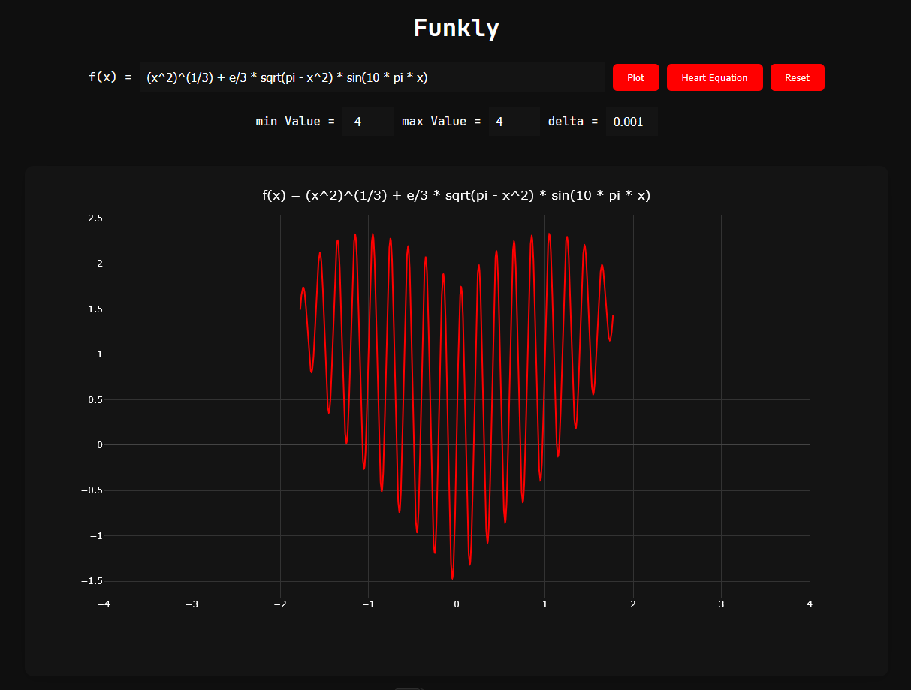

# Funkly
*A lightweight client-side math function plotter built with Vanilla JavaScript + Math.js + Plotly.js.*

  

---

## Badges


---

## Overview

**Funkly** is a fully client-side web application that allows you to:

- Enter real mathematical expressions like `sin(x)`, `x^3 - 2x`, `log(x)`, etc.  
- Automatically parse them using **Math.js**
- Plot them in an interactive chart powered by **Plotly.js**
- Display multiple functions on a single graph (coming soon)
- Use dark mode styling for a clean, modern UI

Everything runs **directly in the browser** — no backend, no API, no server.

You can try it yourself directly here --> https://aitaneuh.github.io/Funkly/

---

## Features

- Clean responsive UI  
- Zoom & pan with Plotly  
- Dark theme  
- Optimized sampling (no browser freezing)  
- Supports:
  - `sin`, `cos`, `tan`
  - `exp`, `sqrt`
  - `log`, `log(x, base)`
  - Constants like `pi`, `e`
- Auto-skip undefined points (division by zero, negative sqrt…)  
- Predefined heart curve

---

## Tech Stack

- **HTML5**
- **CSS3**
- **JavaScript (ES6)**  
- **Math.js** – parsing & evaluation  
- **Plotly.js** – interactive graph plotting  

No bundlers. No frameworks.  
Just pure client-side web magic.

---

## Project Structure

```

/
├── index.html
├── style.css
├── script.js
├── calculate_values.js
└── draw_plot.js

```

---

## How To Run

### Option 1 — Open locally  
Just double-click `index.html`.

### Option 2 — Host on GitHub Pages (recommended)

1. Push the project to a GitHub repository  
2. Go to: **Settings → Pages**  
3. Select branch: `main` / folder: `root`  
4. Hit **Save**

Your website will be available at:

```

https://<your-username>.github.io/<your-repo>/

```

No configuration needed.  
Since everything is client-side, GitHub Pages is perfect.

---

## Example Functions

Try these:

- `sin(3*x) / x`
- `exp(-x^2) * sin(10*x)`
- `x^(2/3)`
- `(x^2)^(1/3) + e/3 * sqrt(pi - x^2) * sin(10*pi*x)` (heart-like curve)
- `log(10, x)`
- `sqrt(abs(x)) * sin(5*x)`